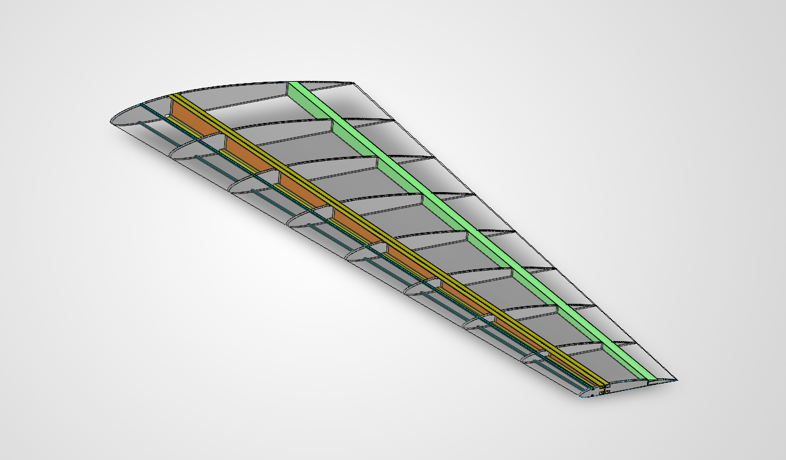
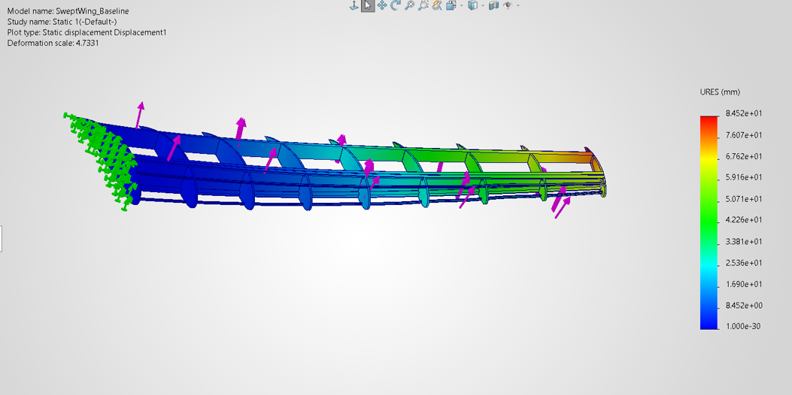
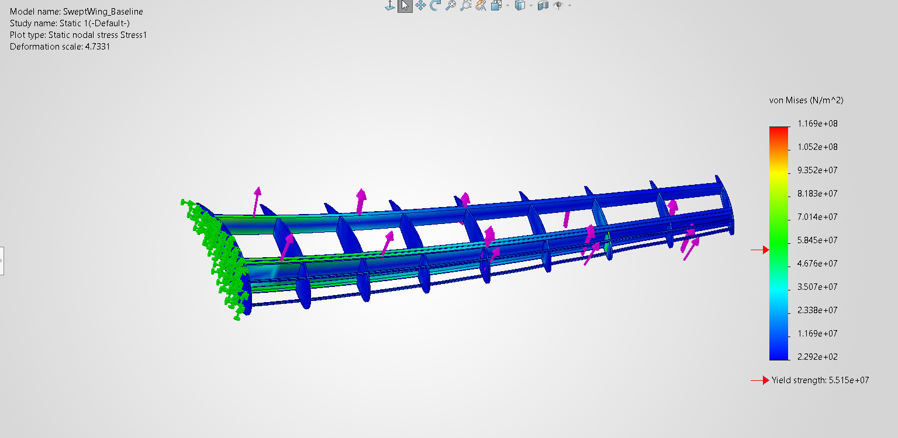
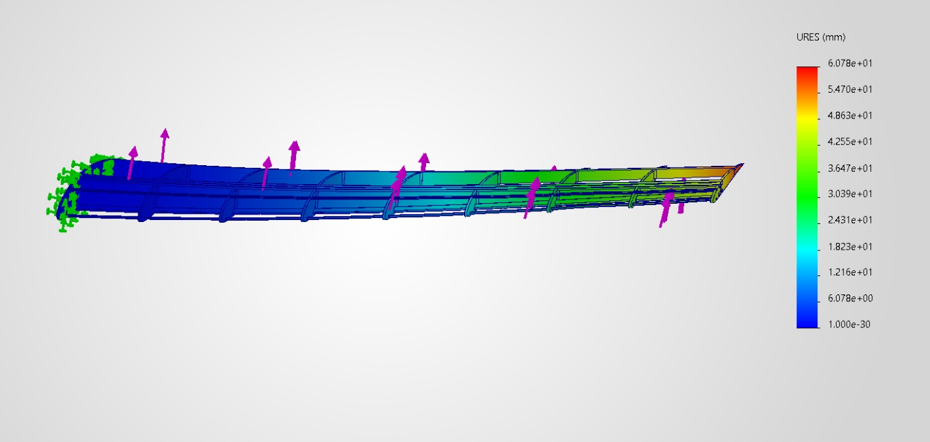

# Swept Wing Structural Design Study

## Overview

This project began as a guided SOLIDWORKS modeling exercise based on a swept-wing tutorial by THECADSPIDER. After completing the CAD model, I expanded the project into an independent structural study using SOLIDWORKS Simulation.

The study investigated whether replacing the aluminum main and rear spars with a higher-specific-stiffness CFRP-like material could reduce structural mass and wing deflection under identical loading conditions.

## Tools & Skills

- SOLIDWORKS 2026
- SOLIDWORKS Simulation
- Surface and multi-body modeling
- Finite Element Analysis (FEA)
- Material selection
- Structural analysis

## Baseline Model

The wing uses a NACA 4412 airfoil and contains ribs, a main spar, rear spar, and additional spanwise structural members.

**Baseline properties:**

| Property | Value |
|---|---:|
| Semi-span | ~4,436 mm |
| Root chord | ~2,019 mm |
| Tip chord | ~808 mm |
| Material | 6061 Aluminum |
| Structural mass | 33.77 kg |

The lofted exterior wing surface was modeled as a zero-thickness reference surface and was excluded from the structural analysis. Therefore, the FEA represents only the internal structural members.

## Structural Analysis

A linear static FEA was performed using the following simplified conditions:

- Wing root fully fixed
- Structural bodies bonded
- 5,000 N total upward test load
- Load distributed across five spanwise structural faces
- Default SOLIDWORKS mesh
- Identical loading and boundary conditions for both configurations

The 5,000 N load was used as a standardized comparison load and does not represent a calculated aerodynamic flight condition.

### Aluminum Baseline

The baseline aluminum structure produced a maximum resultant displacement of **84.52 mm** and a maximum von Mises stress of **116.9 MPa**.

## CFRP-Like Spar Study

I hypothesized that replacing the primary aluminum spars with a CFRP-like material would reduce both structural mass and maximum wing-tip displacement.

The main and rear spars were assigned a simplified CFRP-like material with:

| Property | Assumed Value |
|---|---:|
| Density | 1,500 kg/m³ |
| Elastic Modulus | 150 GPa |
| Poisson's Ratio | 0.30 |
| Shear Modulus | 57.7 GPa |
| Material Model | Linear Elastic Isotropic |

This material is an intentionally simplified representation for an introductory stiffness-to-weight comparison and is **not a validated CFRP laminate model**.

### CFRP-Like Spar Configuration

## Results

| Metric | Aluminum Baseline | CFRP-Like Spars | Change |
|---|---:|---:|---:|
| Total structural mass | 33.77 kg | 27.04 kg | **-19.9%** |
| Maximum displacement | 84.52 mm | 60.78 mm | **-28.1%** |
| Applied test load | 5,000 N | 5,000 N | — |

Under the assumptions of this simplified study, replacing the aluminum main and rear spars with the CFRP-like material reduced modeled structural mass by approximately **20%** while reducing maximum displacement by approximately **28%**.

## Limitations

This study is intended as a comparative learning exercise rather than a prediction of real aircraft performance.

Key limitations include:

- CFRP was approximated as an isotropic material
- The test load was not derived from aerodynamic conditions
- Structural connections were idealized as bonded
- The wing root was modeled as perfectly fixed
- The structural contribution of a physical wing skin was not modeled
- Mesh convergence was not evaluated

## Project Documentation

A more detailed description of the modeling process, assumptions, material study, FEA setup, and results is available in the full project report:

[View Full Project Report](Documentation/Swept_Wing_Structural_Study.pdf)

## Attribution

The original swept-wing CAD geometry was created while following **THECADSPIDER's "Solidworks Swept back wing design" tutorial series** as a SOLIDWORKS learning exercise.

After completing the guided model, I independently expanded the project into the material comparison and structural analysis documented in this repository. I also used ChatGPT as a learning and troubleshooting resource while learning the SOLIDWORKS Simulation workflow and documenting the study.

## Future Work

Potential extensions to this study include:

- Mesh-convergence testing
- Orthotropic composite modeling
- Alternative spar geometries
- Realistic aerodynamic load distributions
- Modeling a structural wing skin
- Additional stiffness-to-weight optimization
